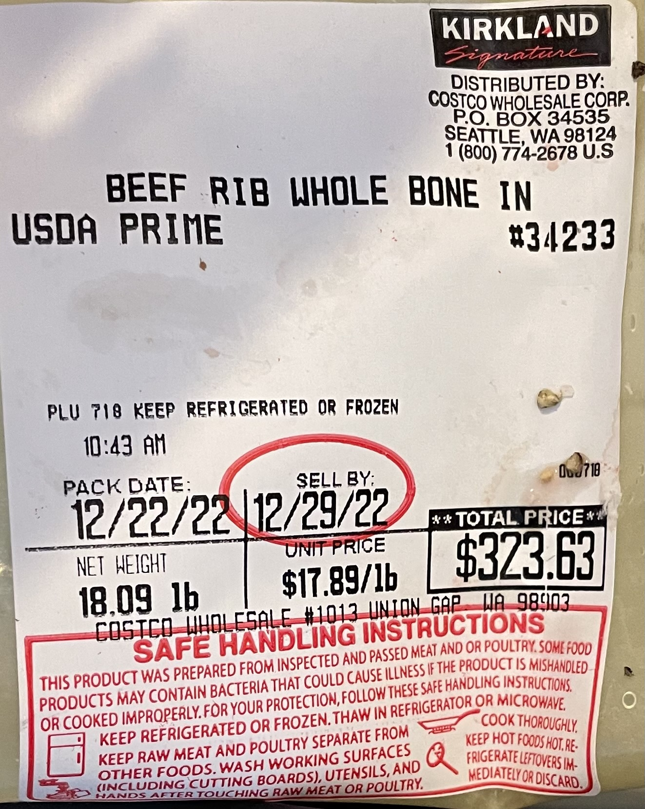

# Meatmaster

Track the progress of cooking your prime rib roast

# Run

## start recording
```shell
./start <year>
```

## graph results
```shell
gnuplot -e "year=<year>" ./meatgraph.gnuplot
```

# Log
## 2022



* 18lb prime rib
* 7 ribs
* 2tsp salt per rib
* salted/peppered and cut the ribs off 2022-12-23T11:00:00PST (no salt reserved)
* garlic pierced into the bottom of the meat 
* Out of the fridge at 6:30AM (34F internal temp)
* Traegar set to smoke at 6:30AM
* Put in traegar at 7:15AM
* Moved probe from side to top-middle near the end of the roast (start in the middle next time)
* took roast out around 2:30PM
* Let rest for about 40 minutes
* There was very little drippings, made a gravy with 4 carrots, an onion, 3 celery stocks, 2 cubes of butter, 2 quarts of beef stock, and flour.
* Seared in oven for ~5 mins
* Plenty of leftovers, had french dips the next day

## 2021


* 17 pound prime rib
* 7 ribs
* 2tsp salt per rib
* roughly 1tsp pepper per rib
* left to dry in fridge for 3 days before  
* salted two days before with half the salt  
* removed from fridge 2 hours before cooking  
* dded pepper and some salt immediately before cooking
* removed ribs from roast before cooking
* cooked full time in a traeger on "smoke" setting (170F-200F)
* started at 8:30AM PST
* took off at 2:39PM PST
* rested for 45 mins
* seared in 550F oven for 6 minutes
* 12 people (+2 with leftovers)
